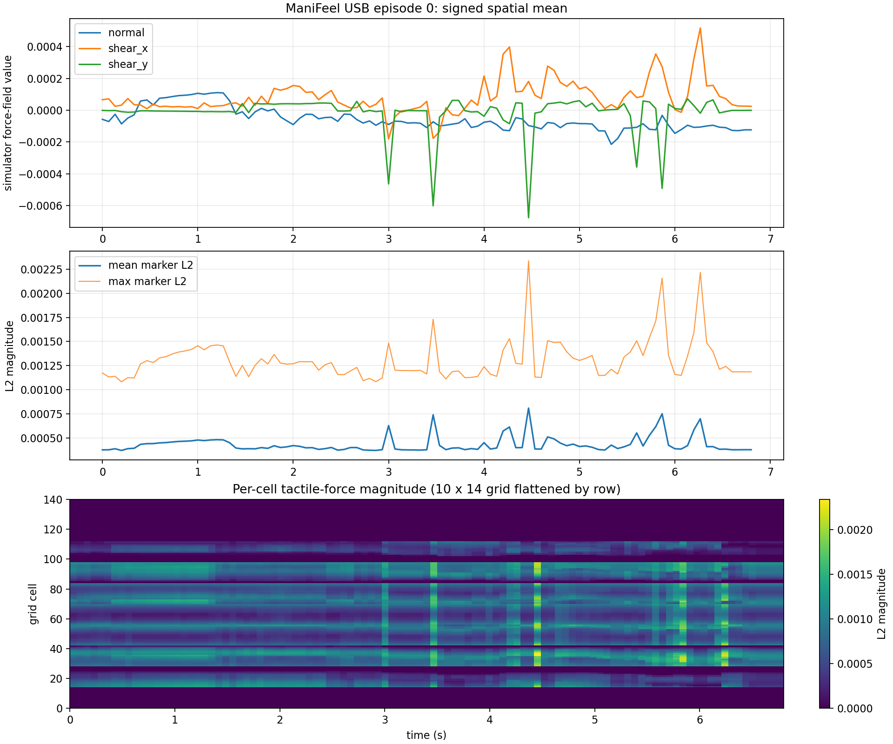

# LeRobot Marvin Force: ManiFeel USB

[Chinese](README.md) | [English](README.en.md)

This is the standalone `manifeel_usb` branch of `lerobot_marvin_force`, built for tactile-force ablations on simulated USB insertion. It uses LeRobot `0.6.1`, converts the official single-arm ManiFeel USB demonstrations into a LeRobot Dataset, and supports Force-conditioned ACT, RDP, ImplicitRDP, and ForceVLA with the official simulator success protocol.

ManiFeel USB was selected because it is the smallest file-verified candidate that provides a direct force signal rather than a constructed proxy. Its official ZIP is `3,991,771,935` bytes and contains 50 complete episodes, 5,976 frames, and a right-finger `10×14×3` tactile force field. The task is single-arm, so this branch belongs in `lerobot_marvin_force`, not the bimanual `lerobot_vlahost_force` repository.

> This is a simulator-specific branch. Its checkpoints output relative end-effector `action[6]`, not Marvin's real-robot joint-position `action[8]`, and never output torque. Do not send these actions to a real Marvin before explicitly adapting the action space, state, cameras, and tactile modality.

## Reproducible sources

| Item | Pinned version |
|---|---|
| ManiFeel code | `purdue-mars/manifeel@ebfa9e1784848903f642ba1b5233f42511a6de62` |
| ManiFeel simulator | `purdue-mars/manifeel-isaacgymenvs@1a61da683cf1485f3307684c740771ea5e842b39` |
| Dataset revision | `purdue-mars/manifeel@d2f3bd1fa7eb38ee807d4f3df2c2a3a3821371ea` |
| Official file | `data/usb_quan_Aug05.zip` |
| File size | `3,991,771,935` bytes |
| File SHA256 | `25e7912dec28282a2294adc34f819be59a01cebc73ec21501d938dc78f64cb00` |
| License | MIT |

The downloader pins that revision and checks both length and SHA256. A moving `main` file is never accepted as an equivalent source.

## Force path in each model

| Model | Force path | Training | Online action |
|---|---|---|---|
| Force-conditioned ACT | Separately projects `state[7]` and `force[420]` into the CVAE and Transformer | One stage | Re-observe, then execute one 6D action |
| RDP | Slow visual diffusion plans a latent; the fast decoder reads current force within the chunk | Tokenizer, then diffusion | Reactive relative EEF action |
| ImplicitRDP | Jointly optimizes the RDP action latent, visual diffusion, and force-conditioned decoder | One stage | Reactive relative EEF action |
| ForceVLA | Keeps the PI0 state projection and maps the 420D field to a separate force token | PI0-base fine-tuning | Re-observe, then execute one 6D action |

ForceVLA does not squeeze the tactile field into PI0's fixed 32D state slot. A separate projection produces the force token, preserving the pretrained state projection shape.

```text
wrist RGB + EEF pose[7] + current right-finger TacFF[420]
                             │
                             ▼
                           Policy
                             │
                             ▼
 action[6] = normalized [Δx, Δy, Δz, axis-angle Δrx, Δry, Δrz]
                             │
                             ▼
              ManiFeel steps and samples fresh TacFF
```

The simulator scales translation by `0.01 m` and rotation by `0.05 rad`. The USB gripper stays closed at `0.0145`, so there is no gripper action channel.

## Workspace

```text
workspaces/manifeel_usb/
├── config/
│   ├── environment.yaml
│   ├── data.yaml
│   ├── train_fcact.yaml
│   ├── train_rdp.yaml
│   ├── train_implicitrdp.yaml
│   ├── train_forcevla.yaml
│   ├── train_vision.yaml
│   └── evaluate.yaml
├── scripts/
│   ├── setup_environment.sh
│   ├── download_dataset.py
│   ├── convert_manifeel_to_lerobot.py
│   ├── audit_dataset.py
│   ├── plot_episode_force.py
│   ├── train.py
│   └── serve_lerobot_act.py
├── manifeel_adapter/
├── tests/
└── run.sh
```

Every configurable YAML parameter has an operator-facing Chinese comment. All four stages are self-contained on this branch; no other model branch is required.

## Stage 1: environment

The server-56 layout is:

```text
repository       /ssd/force/repos/lerobot_marvin_force_manifeel_usb
environment      /ssd/force/envs/lerobot_marvin_manifeel_usb
source data      /ssd/force/datasets/manifeel_usb/source
LeRobot data     /ssd/force/datasets/manifeel_usb/lerobot
outputs          /ssd/force/outputs/lerobot_marvin_force/manifeel_usb
logs             /ssd/force/logs/manifeel_usb
```

```bash
git clone --branch manifeel_usb --single-branch \
  git@github.com:expolrer/lerobot_marvin_force.git \
  /ssd/force/repos/lerobot_marvin_force_manifeel_usb
cd /ssd/force/repos/lerobot_marvin_force_manifeel_usb
./run.sh manifeel-usb env
```

The installer supports the configured offline conda-pack archive as well as an explicit Conda installation. It installs only the LeRobot training, Zarr conversion, plotting, and ZMQ bridge dependencies. PI0, PaliGemma, and ResNet weights must exist at the configured cache paths; preflight checks prevent an unpinned download during training.

The official success environment uses Python `3.8` and a custom IsaacGym/TacSL build. It remains isolated from the LeRobot `0.6.1` Python `3.12` environment. Use H100s for offline training; run the legacy camera-based evaluator on a compatible RTX 4090 host.

## Stage 2: download, conversion, and audit

### Complete source Zarr schema

| Source key | dtype | shape | Meaning |
|---|---|---:|---|
| `data/state` | `float32` | `[5976,7]` | World-frame EEF `x,y,z,qx,qy,qz,qw` |
| `data/action` | `float32` | `[5976,6]` | Normalized relative translation and axis-angle rotation |
| `data/tactile_force_field_right` | `float32` | `[5976,10,14,3]` | Right-finger local `normal,shear_x,shear_y` |
| `data/tactile_depth_right` | `float32` | `[5976,10,14]` | Right tactile depth |
| `data/left_tactile_camera_taxim` | `float32` | `[5976,320,240,3]` | Left tactile RGB |
| `data/right_tactile_camera_taxim` | `float32` | `[5976,320,240,3]` | Right tactile RGB |
| `data/wrist` | `float32` | `[5976,256,256,3]` | Default wrist RGB |
| `data/wrist_2` | `float32` | `[5976,256,256,3]` | Second wrist RGB |
| `data/front` | `float32` | `[5976,256,256,3]` | Front RGB |
| `data/side` | `float32` | `[5976,256,256,3]` | Side RGB |
| `meta/episode_ends` | `int64` | `[50]` | Cumulative episode end offsets |

All 12,218 ZIP entries and every expected Zarr chunk were checked. Episode lengths are 76–168 frames; episode zero has 103 frames. The source has no timestamps. `sim.dt=0.016667 s` and `controlFrequencyInv=4` imply `15 FPS`; the runner's `10 FPS` value is video encoding only.

### Minimal LeRobot mapping

| LeRobot feature | dtype | shape | Conversion |
|---|---|---:|---|
| `observation.images.wrist` | `video` | `[3,256,256]` | `float32[0,1]` to RGB video |
| `observation.state` | `float32` | `[7]` | Preserve EEF pose |
| `observation.tactile_force` | `float32` | `[420]` | Flatten source `[10,14,3]` in HWC C order |
| `action` | `float32` | `[6]` | Preserve the action paired with the current observation |

The flattening order keeps `normal,shear_x,shear_y` adjacent for each taxel. Do not transpose to CHW before flattening.

```bash
./run.sh manifeel-usb data all

# Individual stages
./run.sh manifeel-usb data download
./run.sh manifeel-usb data convert
./run.sh manifeel-usb data audit
```

Downloads support ranges, retries, and checksum verification. Conversion updates its journal atomically only after a complete episode has been saved and finalized. Resume first verifies the source SHA, completed episode prefix, frame count, and schema.

The audit verifies 50 episodes, 5,976 frames, boundaries, dtypes, shapes, finite values, TacFF C order, same-frame action pairing, video decoding, source manifest, and converted statistics. Reports are written to `/ssd/force/reports/manifeel_usb`.



## Stage 3: resumable four-model training

All runs share the same data, split, seed, and force feature. Server 56 maps one run to each GPU:

| GPU | Run |
|---:|---|
| 0 | Force-conditioned ACT |
| 1 | RDP tokenizer followed by RDP diffusion |
| 2 | ImplicitRDP |
| 3 | ForceVLA |

```bash
./run.sh manifeel-usb train all --dry-run
./run.sh manifeel-usb train all

./run.sh manifeel-usb train fcact
./run.sh manifeel-usb train rdp
./run.sh manifeel-usb train implicitrdp
./run.sh manifeel-usb train forcevla
```

Before production, run an isolated real smoke train. It exercises the DataLoader,
forward pass, backward pass, and checkpoint writer while keeping all artifacts
under each output directory's `smoke/` subtree:

```bash
./run.sh manifeel-usb train all --smoke-test
# Raising the target from two to three steps verifies automatic last-checkpoint resume.
./run.sh manifeel-usb train all --smoke-test --smoke-steps 3
```

Each launch looks for:

```text
checkpoints/last/pretrained_model/train_config.json
```

When present, the wrapper uses that saved configuration with `--resume=true`, restoring the model, optimizer, scheduler, random state, and training step. YAML `steps` is the final target step, not an increment. A launch contract rejects unsafe resume after a dataset, world-size, batch-size, force-key, or stage change.

RDP resumes its tokenizer until stage one is complete, then starts or resumes diffusion. W&B and Hub pushes are disabled by default.

The RGB-only ACT ablation uses the same dataset and ACT settings but sets `policy.force_feature_key=null`:

```bash
./run.sh manifeel-usb train vision
```

Keeping the force column in the shared dataset guarantees identical episodes, split, and images for the comparison.

## Stage 4: official simulator success evaluation

The adapter preserves the official USB environment, 50 fixed seeds, 500-step limit, and success predicate. A local ZMQ bridge isolates the two Python environments:

```text
ManiFeel Python 3.8 / IsaacGym             LeRobot Python 3.12
state + wrist + TacFF ── localhost ZMQ ──> processor + policy
6D relative EEF action <────────────────── postprocessor
```

```bash
./run.sh manifeel-usb eval serve fcact \
  --checkpoint /path/to/checkpoints/last/pretrained_model

./run.sh manifeel-usb eval sim fcact --num-envs 1
./run.sh manifeel-usb eval sim fcact --num-envs 50
```

USB succeeds when the mean Euclidean distance across four corresponding plug/socket keypoints is strictly below `0.0079916 m`. The official wrapper maps the success reset to reward, so:

```text
success_rate = mean(max reward over time for each environment)
```

Evaluation fixes `n_action_steps=1`, sampling fresh TacFF after every action. Force and vision ablations must use identical `test_start_seed`, environment count, and step limit.

## References and scope

- ManiFeel code: <https://github.com/purdue-mars/manifeel>
- ManiFeel data: <https://huggingface.co/datasets/purdue-mars/manifeel>
- This branch invokes native LeRobot `lerobot-train`; it does not rename ManiFeel's Diffusion Policy trainer.
- Server 56 H100s are used only for offline training. Record driver, CUDA, simulator commit, and seeds separately when running the legacy IsaacGym/TacSL evaluator on a compatible GPU.
